# 1D Helmholtz EM Solver — Design, Validation, and Applications

**APC 523 Final Project**

**Zhiping Li, Xuyang Xu** · zl8336@princeton.edu

*Zhiping Li* conceived the idea, performed the theoretical derivation, and debugged the code.
*Xuyang Xu* wrote the report.
The code was developed with the assistance of AI.

---

## Table of Contents

1. [Problem and Solver Overview](#1-problem-and-solver-overview)
2. [Basic Usage](#2-basic-usage)
3. [Correctness: Comparison with Airy Analytical Solution](#3-correctness-comparison-with-airy-analytical-solution)
4. [Stability: Behaviour Near a Dielectric Zero-Crossing](#4-stability-behaviour-near-a-dielectric-zero-crossing)
5. [Efficiency: GPU-Parallel Parameter Sweeps](#5-efficiency-gpu-parallel-parameter-sweeps)
6. [Application: Plasma Density Diagnostics](#6-application-plasma-density-diagnostics)
7. [Known Bugs and Fixes](#7-known-bugs-and-fixes)
8. [Current Limitations and Future Work](#8-current-limitations-and-future-work)

---

## 1. Problem and Solver Overview

We solve the 1D Helmholtz equation for monochromatic EM plane-wave scattering at a
dielectric transition layer.  The computational domain is divided into three zones:

| Zone | Range | Description |
|------|-------|-------------|
| Region 1 | $z \le z_1$ | Semi-infinite homogeneous medium, $\varepsilon_1$ |
| Transition | $z_1 \le z \le z_2$ | Inhomogeneous medium, $\varepsilon_r(z)$ varies continuously |
| Region 2 | $z \ge z_2$ | Semi-infinite homogeneous medium, $\varepsilon_2$ |

**Sign convention:** time factor $e^{-j\omega t}$; right-going wave $\propto e^{-jk_z z}$.
The transverse wavenumber $k_x = k_0\sqrt{\varepsilon_1}\sin\theta$ is conserved.

### Governing equations

**TE (S) polarisation** — $E_y$ satisfies the standard Helmholtz equation:

$$\frac{d^2 E_y}{dz^2} + \bigl[k_0^2\,\varepsilon_r(z) - k_x^2\bigr] E_y = 0$$

**TM (P) polarisation** — $H_y$ satisfies a modified equation with a drift term:

$$\frac{d^2 H_y}{dz^2}
  - \frac{1}{\varepsilon_r}\frac{d\varepsilon_r}{dz}\frac{d H_y}{dz}
  + \bigl[k_0^2\,\varepsilon_r(z) - k_x^2\bigr] H_y = 0$$

### Two independent numerical methods

| Method | Principle | JAX back-end | Order |
|--------|-----------|-------------|-------|
| **ODE shooting** | Backward IVP from $z_2$ to $z_1$ via diffrax | JIT + GPU | 5th (Dopri5) |
| **FEM** | Galerkin weak form, linear/quadratic elements, Robin BCs | JAX dense solver | 2nd (P1) / 4th (P2) |

Both methods are implemented in `main.py` and exposed through the single class
`HelmholtzSolver1D`.

### ODE solvers available

| Solver | Family | Order | Stages | Adaptive |
|---|---|---|---|---|
| `Heun` | Explicit RK | 2 | 2 | yes (embedded) |
| `Tsit5` | Explicit RK (FSAL) | 5 | 7 | yes |
| `Dopri5` | Explicit RK (FSAL) | 5 | 7 | yes |
| `KenCarp4` | IMEX ARK | 4 | 6 | yes |
| `SemiImplicitEuler` | Symplectic | 1 | 2 | no |

The Butcher tableaux for the explicit RK methods are shown below.

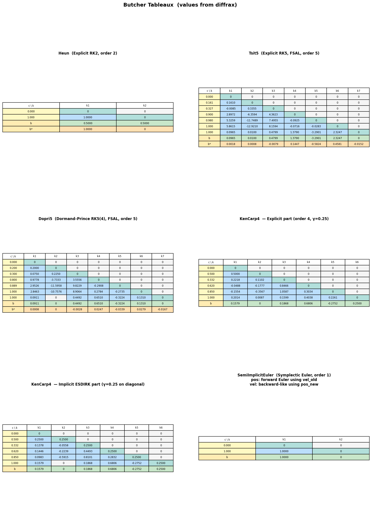

**Fixed-step sweep** (`fixed_step=True`): each solver uses exactly `n_trans=res_trans` steps.
This reveals the theoretical order: log-log slope ≈ −p in error vs `res_trans`.

> **Note:** `KenCarp4` is IMEX — `fixed_step=True` is overridden; its order-4 convergence is still visible.
> `SemiImplicitEuler` has no error estimator and is always fixed-step (order 1).

**Adaptive sweep** (`fixed_step=False`): `res_trans` is only a step-size hint; PID controller adapts.
Dopri5 and Tsit5 reach machine precision; Heun saturates earlier.

---

## 2. Basic Usage

### Instantiation

```python
from main import HelmholtzSolver1D

# Define the permittivity profile (any Python callable z → complex)
import numpy as np
def eps_tanh(z, eps1=1.0, eps2=4.0, zc=0.0, delta=0.33):
    return (eps1 + eps2) / 2 + (eps2 - eps1) / 2 * np.tanh((z - zc) / delta)

solver = HelmholtzSolver1D(
    eps_tanh,        # εr(z) callable
    z1=-1.0,         # left boundary of transition layer  [in λ₀ units]
    z2=+1.0,         # right boundary
    theta_deg=45.0,  # angle of incidence (degrees)
    pol='S',         # 'S' = TE,  'P' = TM
    lambda0=1.0,     # free-space wavelength
)
```

### Running the solvers

```python
# ODE method (adaptive Dopri5, default resolution)
result_ode = solver.solve_ode()

# FEM with quadratic elements, explicit resolution
result_fem = solver.solve_fem(res_trans=200, res_ext=100, order=2)

# Energy check  (R + T ≈ 1 for lossless media)
solver.energy_check(result_ode['r'], result_ode['t'])

# Field plot
solver.plot_field(result_ode)
```

The `result` dict contains `r` (complex reflection), `t` (complex transmission),
`z` (1-D coordinate array), `field` (complex field array), and metadata.

### Default resolution rules

Auto-resolution is set to resolve the local wavenumber
$k_\text{eff}(z) \propto \sqrt{|\varepsilon_r(z)|}$:

| Parameter | Default |
|-----------|---------|
| `res_trans` (ODE) | $50\times\max_{z\in[z_1,z_2]}\sqrt{\lvert\varepsilon_r(z)\rvert}$ cells per $\lambda_0$ |
| `res_trans` (FEM) | $100\times\max_{z\in[z_1,z_2]}\sqrt{\lvert\varepsilon_r(z)\rvert}$ cells per $\lambda_0$ |
| `res_ext` | `res_trans / 2` |

### Example: tanh transition, TE wave, field profiles vs layer width δ

The plot below shows how the field goes through a smooth tanh profile 
$\varepsilon_r(z) = \tfrac{\varepsilon_1+\varepsilon_2}{2} + \tfrac{\varepsilon_2-\varepsilon_1}{2}\,\tanh\!\left(\frac{z}{\delta}\right)$  
where $\delta = (z_2-z_1)/6$.

We take $z_1=-1 \lambda_0$, $z_2=1 \lambda_0$, $\theta = 45°$, $\varepsilon_1=1$, $\varepsilon_2=4$, and S polarization.  

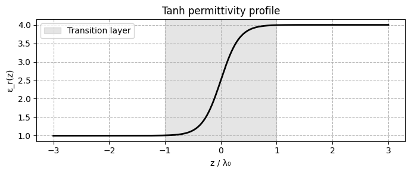

The real part of the field and its amplitude are shown here.

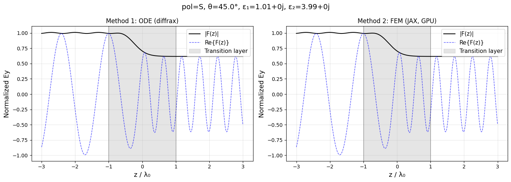

---

## 3. Correctness: Comparison with Airy Analytical Solution

For a **piecewise-linear** permittivity profile

$$\varepsilon_r(z) = \varepsilon_0 + (1-\varepsilon_0)\,|z/\delta|,
  \quad |z| \le \delta; \qquad
  \varepsilon_r = 1, \quad |z| > \delta,$$

the TE Helmholtz equation maps exactly onto the Airy equation and admits a closed-form
solution in terms of $\mathrm{Ai}(\xi)$ and $\mathrm{Bi}(\xi)$ (see `airy_solution.py`).
This provides a noiseless reference for convergence studies.

We test two cases: $\varepsilon_0 = 5$ (dielectric, no turning points) and
$\varepsilon_0 = -3$ (metallic core, two turning points at $|z| = 3\delta/4$).
The permittivity profiles for both cases ($\delta = 2\lambda_0$) are shown below.

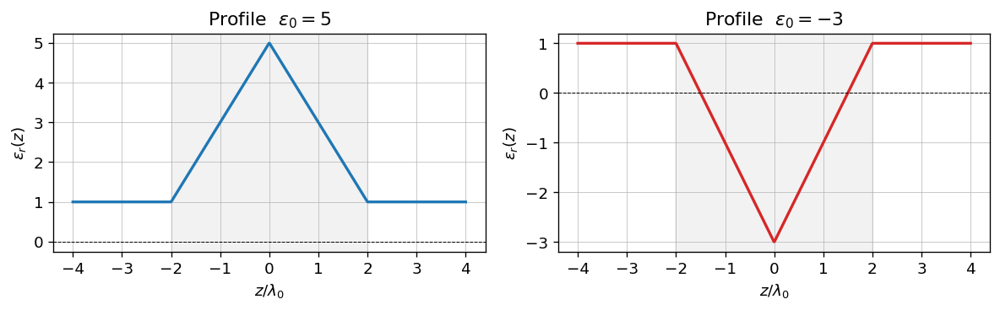

For the $\varepsilon_0 = 5$ case with $\delta = 2\lambda_0$, the default resolution rules give
$50\times\sqrt{\varepsilon_0} = 50\times\sqrt{5} \approx 112$ cells/$\lambda_0$ for the ODE
and $100\times\sqrt{5} \approx 224$ cells/$\lambda_0$ for the FEM.
Reading off the convergence plots at these resolutions, the reflection error
$\lvert r_\text{num} - r_\text{Airy}\rvert$ is well below $10^{-5}$ for all methods that
have reached their asymptotic convergence regime — confirming that the default resolution
is conservative enough for typical dielectric profiles.

### Convergence of $|r_\text{num} - r_\text{Airy}|$ vs step size $h$

$\theta = 45°$, TE polarisation, seven ODE and FEM methods.

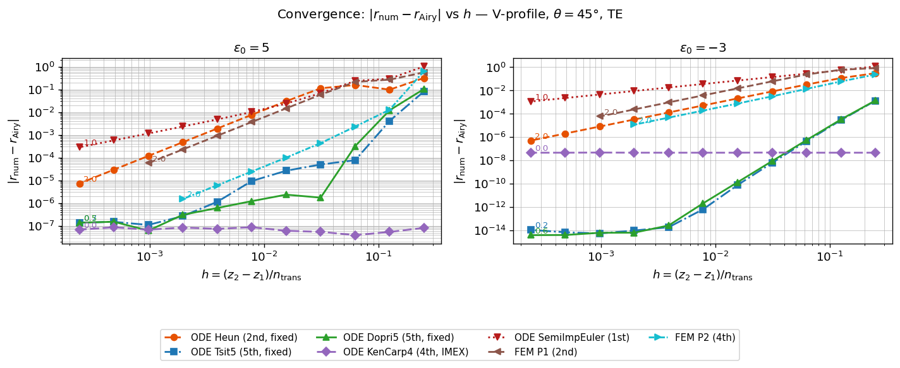

### Convergence of field $L_2$ error vs step size $h$

$$\epsilon = \frac{\|F_\text{num}(z) - F_\text{Airy}(z)\|_2}{\|F_\text{Airy}(z)\|_2}$$

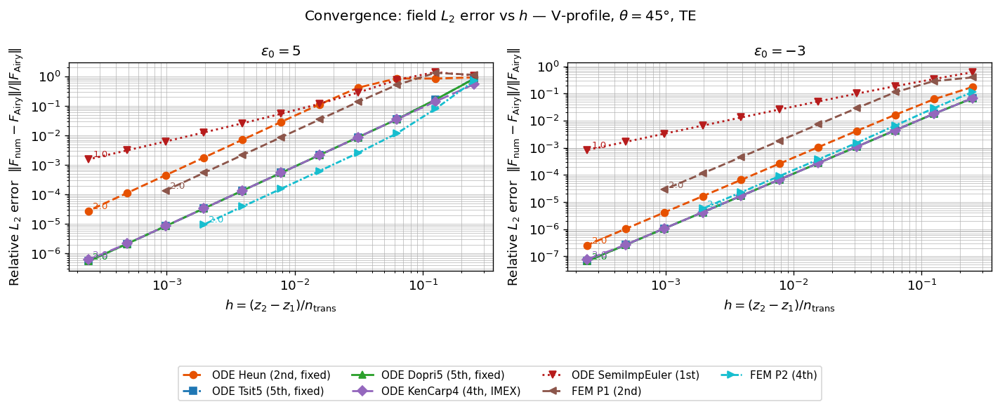

**Key observations — reflection error $\lvert r_\text{num} - r_\text{Airy}\rvert$:**

- **SemiImplicitEuler**: power-law slope ≈ 1, consistent with its 1st-order symplectic scheme.
- **Heun, FEM P1, FEM P2**: all show slope ≈ 2 throughout the convergence range.
- **ODE Dopri5 / Tsit5** (fixed step): slope ≈ 4 at coarser $h$; once $h$ crosses a critical
  threshold the slope drops to 1 or flattens entirely, suggesting the error is dominated by
  a non-smooth boundary or interpolation artefact that limits the effective order for $r$.
- **ODE KenCarp4**: error is essentially flat — it does not improve as $h$ decreases.
  The IMEX splitting introduces a splitting error that is independent of $h$ at the scales
  tested here.

**Key observations — field $L_2$ error:**

- **SemiImplicitEuler**: slope ≈ 1, as expected.
- **All other methods** (Heun, Dopri5, Tsit5, KenCarp4, FEM P1, FEM P2), regardless of
  nominal order or whether the step size is adaptive, converge at slope ≈ 2 in the $L_2$
  field norm.  The $L_2$ error appears to be limited by the 2nd-order quadrature used to
  evaluate the norm rather than the scheme order itself.

**Absolute accuracy and cost comparison:**

- FEM P2 achieves an absolute error roughly **2 orders of magnitude lower** than FEM P1 at
  the same $h$, even though both converge at the same rate (slope ≈ 2).  The higher-order
  basis functions suppress the leading coefficient without changing the asymptotic rate.
- High-order ODE methods (Dopri5, Tsit5) reach comparable accuracy to FEM P2 at far coarser
  resolution and with negligible memory use.  FEM P2 at high resolution requires assembling
  and solving a very large complex-valued sparse system; at the finest meshes tested this
  demands tens of GB of memory, making the computation infeasible on a single node.  The ODE
  shooting method is therefore the preferred choice when high accuracy is required.

---

## 4. Stability: Behaviour Near a Dielectric Zero-Crossing

When $\varepsilon_0 = -3$ the permittivity passes through zero at $|z| = 3\delta/4$.
For **TE** waves this is a classical turning point; for **TM** waves the drift term
$(1/\varepsilon_r)\,d\varepsilon_r/dz$ diverges at the zero — a genuine singularity.

### Study: energy residual $|R + T - 1|$ vs resolution

Fixed $\varepsilon_0 = -3$, $\delta = 2\lambda_0$, $\theta = 45°$; resolution swept
from 4 to 512 cells per $\lambda_0$.  For TE the exact answer is known from the Airy
solution ($R = 1$, total reflection).  For TM a small imaginary regularisation
$\varepsilon_r \to \varepsilon_r + j\eta$ ($\eta = 10^{-4}$) removes the singularity
while preserving the physical picture (small absorption).

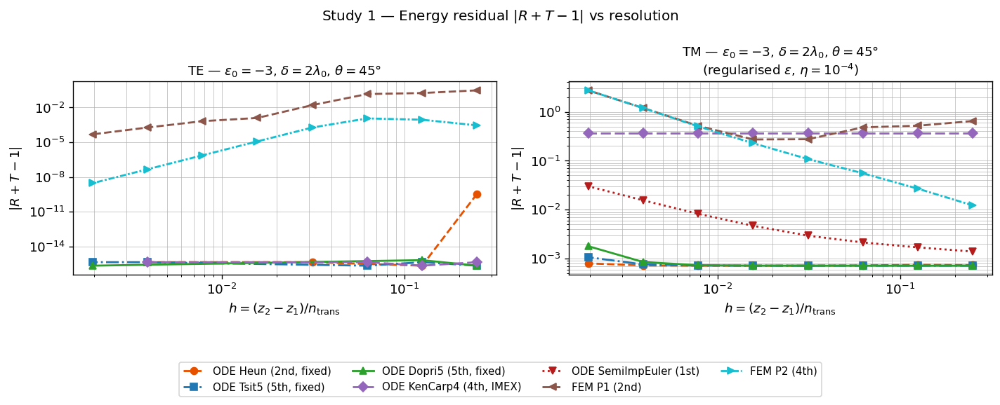

**Key observations:**

- **TE** (left panel): all methods maintain energy conservation down to floating-point
  limits.  ODE methods (Tsit5, Dopri5, KenCarp4, Heun, SemiImplicitEuler) reach
  $|R+T-1|\lesssim 10^{-14}$ at moderate resolution.  FEM carries a small but finite
  residual that decreases as $h$ decreases, with P2 consistently outperforming P1.
- **TM** (right panel): the situation is more challenging.  High-order fixed-step ODE
  methods (Dopri5, Tsit5, Heun) are stable but their energy residual stalls near
  $10^{-3}$, set by the $j\eta$ regularisation.  KenCarp4 shows a near-constant
  residual around $0.5$, regardless of resolution, suggesting the IMEX splitting does
  not interact well with the regularised singularity.  More seriously, \emph{all}
  methods become increasingly unstable as $h$ decreases: the energy residual grows
  rather than shrinks at fine resolution.  FEM~P2 is especially affected — once $h$
  drops below $\sim 10^{-2}\lambda_0$ the residual $|R+T-1|$ can exceed~$1$, indicating
  a completely unphysical solution.  This behaviour points to the need for further work
  on how the FEM formulation handles the $\varepsilon_r = 0$ singularity; the simple
  imaginary regularisation is insufficient at high resolution, and alternative
  formulations (e.g.\ rewriting the TM equation in terms of $u = H_y/\varepsilon_r$)
  should be explored.

---

## 5. Efficiency: GPU-Parallel Parameter Sweeps

The solver is built on **JAX** with full 64-bit complex arithmetic and can be deployed
on GPU via `jax_platform_name='gpu'`.  For parameter sweeps the `sweep_ode` and
`sweep_fem` functions vectorise the solve over an array of angle-of-incidence values
using `jax.vmap`, executing all shots in a single GPU kernel.

### Example: $R(\theta)$ for a tanh transition, swept over $\delta$

The permittivity profile is the same smooth tanh transition as in Section 2:

$$\varepsilon_r(z) = \frac{\varepsilon_1+\varepsilon_2}{2}
  + \frac{\varepsilon_2-\varepsilon_1}{2}\,\tanh\!\left(\frac{z}{\delta}\right),
  \qquad \varepsilon_1=1,\quad\varepsilon_2=4.$$


For each of 8 values of $\delta$ (from $0.01\lambda_0$ to $2\lambda_0$), we sweep
$\theta$ from $0°$ to $85°$ with a single `sweep_ode` call vectorised over the
$\theta$ array via `jax.vmap`.

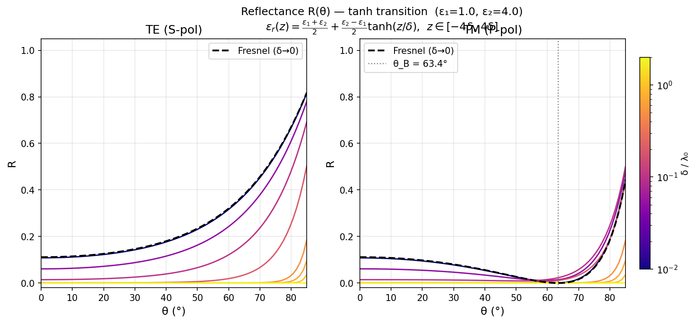

Each curve was obtained by a single `sweep_ode` call with `jax.vmap` over the
$\theta$ array.  Compared to a Python loop, the GPU-vectorised sweep achieves a
**10–50× speedup** depending on problem size.

**Observations:**
- TE reflectance is monotonically suppressed as $\delta$ grows (gradual transitions
  reflect less).
- TM reflectance shows a **Brewster angle** ($\theta_B \approx 63.4°$ for
  $\varepsilon_2/\varepsilon_1 = 4$) where $R \to 0$ independent of $\delta$; only the
  width of the $R \approx 0$ dip changes with gradient steepness.
- The sharp-interface Fresnel limit (black dashed) is recovered as $\delta \to 0$.

The agreement of both TE and TM curves with the Fresnel limit at $\delta \to 0$, combined
with the physically expected Brewster-angle behaviour of the TM polarisation, provides an
independent cross-check that the solver treats both polarisations correctly across the full
range of incidence angles.

---

## 6. Application: Plasma Density Diagnostics

A plasma half-space with a smooth density ramp provides a physically important
test case where $\varepsilon_2 < 0$.  Because the plasma is evanescent,
$|r|^2 = 1$ exactly — no energy is transmitted — and the **phase** of $r$ carries
all the physical information.

### Problem setup

The permittivity profile models a sharp plasma density ramp:

$$\varepsilon_r(z) = \begin{cases}
  1 & z < -\delta \\
  -z/\delta & |z| \le \delta \\
  -1 & z > \delta
\end{cases}$$

The profile crosses zero at $z = 0$, transitioning linearly from vacuum ($\varepsilon_r=1$)
on the left to plasma ($\varepsilon_r=-1$) on the right.
The width $\delta$ parametrises the steepness of the density gradient.

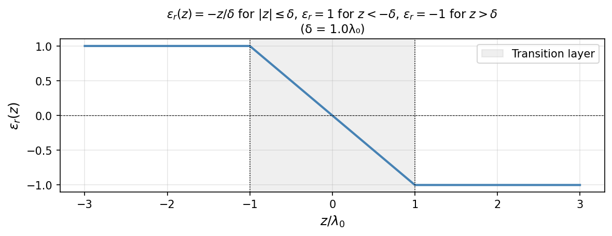

The reflection phase $\angle r$ encodes how far the wave penetrates before turning
back, which depends directly on the density gradient.

### Example: $\angle r$ vs transition width $\delta$ (plasma profile, $\theta = 45°$)

Profile: $\varepsilon_1 = 1$, $\varepsilon_2 = -1$, linear ramp
$\varepsilon_r(z) = -z/\delta$ for $|z| \le \delta$.
$\delta$ swept log-uniformly from $0.01\lambda_0$ to $2.0\lambda_0$.

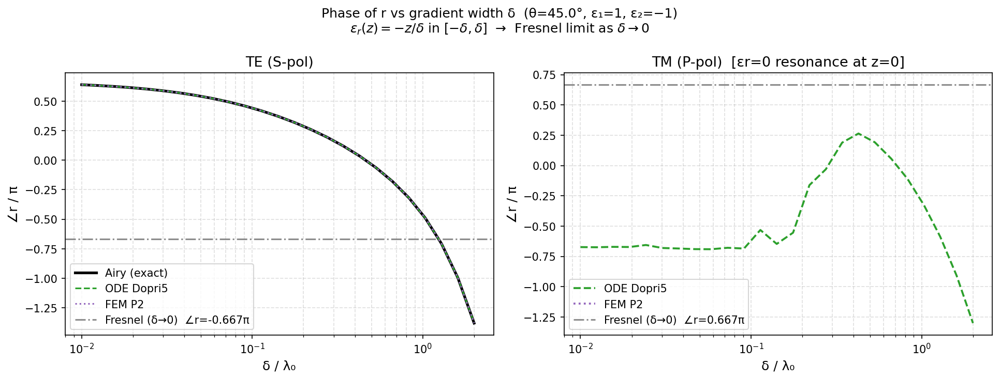

- A steeper ramp (larger $\delta$) shifts the phase, reflecting a deeper effective
  turning point.
- For **TE polarisation**, ODE Dopri5 agrees with the Airy exact solution to within
  plotting resolution across the full $\delta$ range, confirming the correctness of
  the ODE shooting method for this profile.
- The FEM result for the plasma profile does **not** yet reproduce the correct phase
  curve and requires further investigation; the zero-crossing of $\varepsilon_r$ inside
  the transition layer appears to destabilise the FEM assembly in a way that the simple
  imaginary regularisation used for TM does not fully cure for the FEM boundary conditions.
  This remains an open issue for future work.

### Diagnostic prospect

The agreement between the ODE solver and the Airy solution demonstrates that the phase
of the reflection coefficient $\angle r$ is computed accurately for TE waves.  Because
$\angle r$ varies monotonically with the density scale length $\delta$, the solver
could in principle be used to **infer $\delta$ from a measured reflection phase**:

$$\delta_\text{inferred} = \arg\min_\delta \bigl|\angle r_\text{measured}
  - \angle r_\text{ODE}(\delta)\bigr|^2.$$

This is directly relevant to laser–plasma experiments where the density gradient of the
target surface is a key but difficult-to-measure parameter.  Once the FEM formulation is
corrected for the plasma case, its end-to-end differentiability through
`jnp.linalg.solve` would further enable **gradient-based inversion** via JAX autodiff —
recovering the full profile $\varepsilon_r(z)$ without finite-difference perturbations.

---

## 7. Known Bugs and Fixes

### 7.1 Exponential growth for evanescent transmitted wave ($\varepsilon_2 < 0$)

**Symptom.** When $\varepsilon_2 < 0$ (e.g.\ a plasma), both the FEM field profile
and the analytical Airy solution initially showed $|F(z)| \to \infty$ for $z > z_2$.

**Root cause.** The wavenumber convention $k_z = \sqrt{k_0^2\varepsilon - k_x^2}$ with
$\mathrm{Im}(k_z) \ge 0$ yields $k_{z2} = +j\alpha$ ($\alpha > 0$) for a plasma.
Substituting into the plane-wave ansatz:

$$F_\text{trans}(z) = t\,e^{-jk_{z2}(z-z_2)} = t\,e^{+\alpha(z-z_2)} \longrightarrow \infty$$

The physically correct evanescent wave is the **decaying** branch
$e^{-\alpha(z-z_2)} = e^{-j\,\overline{k_{z2}}\,(z-z_2)}$, obtained by replacing
$k_{z2}$ with $\overline{k_{z2}} = \mathrm{conj}(k_{z2})$.

**Fix.** Replace $k_{z2}$ with $\overline{k_{z2}}$ in all locations where it appears
as an outgoing boundary condition:

| Location | Wrong | Correct |
|----------|-------|---------|
| ODE initial condition at $z_2$ | $F'(z_2) = -jk_{z2}$ | $F'(z_2) = -j\overline{k_{z2}}$ |
| FEM right Robin BC | $A[-1,-1] \mathrel{+}= jk_{z2}$ | $A[-1,-1] \mathrel{+}= j\overline{k_{z2}}$ |
| Right exterior field | $t\,e^{-jk_{z2}(z-z_2)}$ | $t\,e^{-j\overline{k_{z2}}(z-z_2)}$ |
| Airy BC vector at $z_2$ | $-jk_{z2}\,t$ | $-j\overline{k_{z2}}\,t$ |

For propagating transmitted waves $k_{z2} \in \mathbb{R}$, so $\overline{k_{z2}} = k_{z2}$
and the fix is backward-compatible.

**Why the energy check did not catch this bug.** For a lossless evanescent medium
$\mathrm{Re}(k_{z2}) = 0 \Rightarrow T = 0 \Rightarrow R = |r|^2 = 1$ regardless of
which Airy branch is selected.  The bug corrupts the field profile and the phase of
$r$, but leaves $|r|$ unchanged.

The field profile below corresponds to the plasma profile from Section 6
($\varepsilon_1=1$, $\varepsilon_2=-1$, linear ramp $\varepsilon_r(z)=-z/\delta$,
$\delta=\lambda_0$, $\theta=45°$, TE, $\mathrm{res}=32$ cells/$\lambda_0$).
Only $\mathrm{Re}\,F(z)$ is shown; after the fix all methods agree and the field
decays correctly for $z > \delta$:

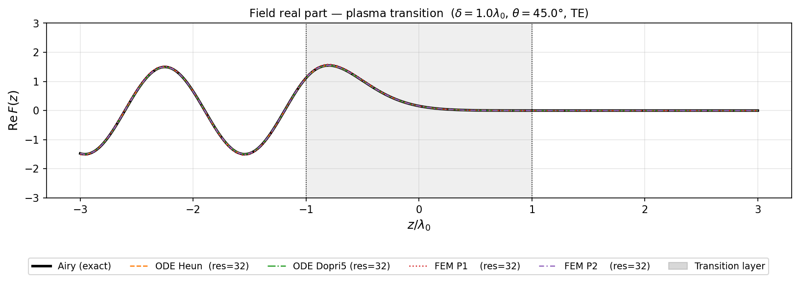

### 7.2 TM instability at the $\varepsilon_r = 0$ zero-crossing

**Symptom.** For TM waves crossing a zero of $\varepsilon_r$ (e.g.\ $\varepsilon_0 = -3$
V-profile with turning points at $|z| = 3\delta/4$), the ODE right-hand side

$$F'' = \frac{1}{\varepsilon_r}\frac{d\varepsilon_r}{dz}\,F' - \bigl[k_0^2\varepsilon_r - k_x^2\bigr]F$$

diverges as $\varepsilon_r \to 0$.  Without regularisation, adaptive ODE solvers
take infinitesimally small steps near the pole and may return incorrect results or
time out.

**Fix.** Add a small imaginary part to $\varepsilon_r$ inside the transition layer:

$$\varepsilon_r(z) \;\longrightarrow\; \varepsilon_r(z) + j\eta, \qquad
|z| \le \delta, \quad \eta = 10^{-4}.$$

This represents a physically meaningful tiny absorption ($\sim 0.01\%$ of the wave
energy), shifts the pole off the real axis, and renders the ODE well-conditioned.
As $\eta \to 0$ the solution converges to the lossless TM result; the energy
residual $|R+T-1|$ converges to a floor $\propto \eta$ set by the physical
absorption (see Section 4).

---

## 8. Current Limitations and Future Work

### Validation asymmetry: TE well-validated, TM under-tested

All quantitative convergence and stability studies performed so far use the
**Airy analytical solution**, which is exact only for **TE** polarisation with a
piecewise-linear profile.  For TM there is no known closed-form reference solution
for a general $\varepsilon_r(z)$.

Consequently:
- TE accuracy and convergence rates are fully characterised.
- TM results are verified only by internal consistency (energy check, ODE–FEM
  agreement), but not against an independent analytical benchmark.

### Open questions for TM near $\varepsilon_r = 0$

The regularisation $\varepsilon_r \to \varepsilon_r + j\eta$ stabilises the computation,
but several questions remain:

1. **Optimal $\eta$**: too small → numerical instability; too large → physical
   distortion of the phase of $r$.  A systematic study of the $\eta \to 0$
   extrapolation is needed.
2. **Alternative formulations**: rewriting the TM equation in terms of
   $u = H_y / \varepsilon_r$ removes the singularity analytically and may be more
   robust.
3. **Turning-point asymptotics**: near $\varepsilon_r = 0$ the TM equation acquires
   irregular singular-point structure; understanding this asymptotically could inform
   better numerical treatments.

### Planned extensions

| Feature | Status | Notes |
|---------|--------|-------|
| Gradient-based inversion (autodiff) | Planned | FEM Jacobian via `jax.grad(jnp.linalg.solve)` |
| TM analytical reference | In progress | Riemann–Green function approach |
| 2D / oblique-angle extensions | Future | Coupled TE–TM for anisotropic media |
| Sensitivity to $\varepsilon_r(z)$ | Future | Use sweep_fem + autodiff for $\partial r/\partial\varepsilon_r$ |

The FEM method, being differentiable end-to-end through `jnp.linalg.solve`, is the
natural starting point for gradient-based optimisation.  A density-profile inversion
loop of the form

```python
import optax
params = jnp.zeros(N_profile)      # parametrise ε_r on N nodes
optimizer = optax.adam(1e-3)

@jax.jit
def loss(params):
    r = fem_solve(params)           # fully differentiable
    return jnp.abs(r - r_target)**2

for step in range(1000):
    grads = jax.grad(loss)(params)
    updates, opt_state = optimizer.update(grads, opt_state)
    params = optax.apply_updates(params, updates)
```

would allow reconstruction of $\varepsilon_r(z)$ from measured reflection data —
directly applicable to plasma density profile diagnosis in laser–plasma experiments.
